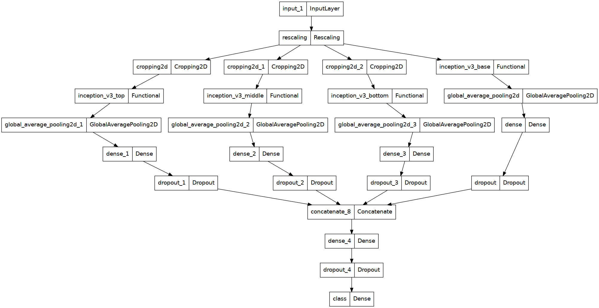

# Document Classification

This repository refers to a computer vision model that applies transfer learning techniques.

Image augmentation mothods were also used, as well as image cropping for feature extraction in parallel to the entire image.

The chosen dataset was RVL-CDIP (Ryerson Vision Lab Complex Document Information Processing), from Hugging Face.

The goal was to classify a given document into one of 4 chosen classes representing document types (scientific publication, budget, invoice and memo). 

